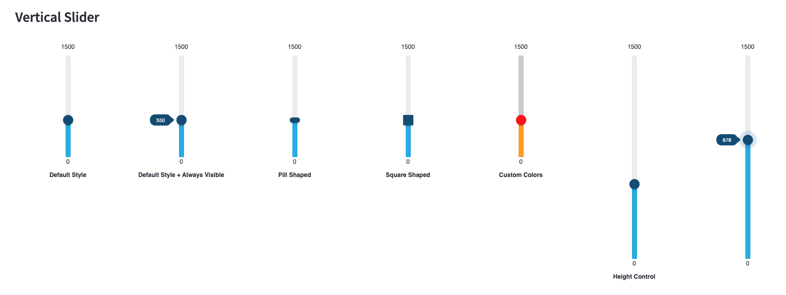

# streamlit-vertical-slider

Creates a constinuous vertical slider with color customizations. 

---
## Update ⚠️
### Version 2.0  
Changes:
 - Adds optional `label` argument
 - Adds optional `thumb_shape` argument (circle, square, pill)
 - Adds optional `height` argument, defaults to 200
 - Upgrade to Material-UI v5
 - Centralized labels and values
 - Support for Dark Mode





Please update by:
```shell
pip install --upgrade streamlit-vertical-slider
```

---
## Installation
```shell
pip install streamlit-vertical-slider
```
## Usage

```python
import streamlit as st
from  streamlit_vertical_slider import vertical_slider 

vertical_slider(
    label = "Your widget label",  #Optional
    key = "vert_01" ,
    height = 300, #Optional - Defaults to 300
    thumb_shape = "square", #Optional - Defaults to "circle"
    step = 1, #Optional - Defaults to 1
    default_value=5 ,#Optional - Defaults to 0
    min_value= 0, # Defaults to 0
    max_value= 10, # Defaults to 10
    track_color = "blue", #Optional - Defaults to #D3D3D3
    slider_color = 'lighgray', #Optional - Defaults to #29B5E8
    thumb_color= "orange", #Optional - Defaults to #11567f
    value_always_visible = True ,#Optional - Defaults to False
)
```